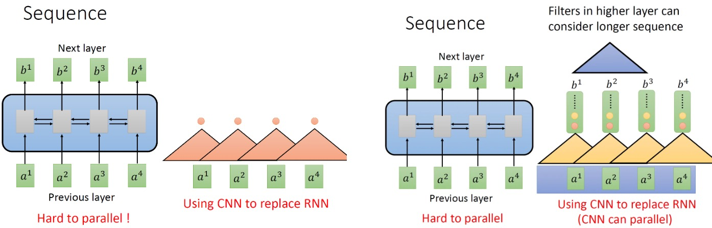
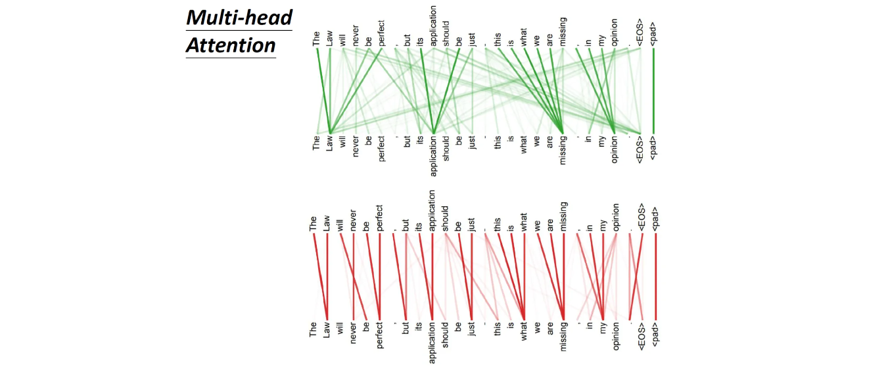

# Transformer

date: May 6, 2023, author: @Jiyao Liu 

## 参考资料

[Vision Transformer 超详细解读 (原理分析+代码解读) (一)](https://zhuanlan.zhihu.com/p/340149804?utm_medium=social&utm_oi=998216950467743744&utm_psn=1636827853579972608&utm_source=wechat_session)

[https://github.com/jadore801120/attention-is-all-you-need-pytorch](https://github.com/jadore801120/attention-is-all-you-need-pytorch)

> Transformer 模型使用了 Self-Attention 机制，**不采用** RNN 的**顺序结构**，使得模型**可以并行化训练**，而且能够**拥有全局信息。**
> 

## 1. Self-attention

### **1.1 处理Sequence数据的模型**

- RNN
    
    如果假设是一个single directional的RNN，那当输出$b_4$时，默认$a_1,a_2,a_3,a_4$都已经看过了。
    
    如果假设是一个bi-directional的RNN，那当输出任意$b_{任意}$任意时，默认$a_1,a_2,a_3,a_4$都已经看过了
    
    RNN很不容易并行化：必须逐个元素计算（左1）；CNN代替RNN实现并行计算，但是只能考虑有限内容，通过多堆叠几层CNN，使得CNN的感受野变大，如下图：
    
    <!--      -->
    
    
A simple, elegant caption looks good between image rows, after each row, or doesn't have to be there at all.

	
	
	A simple, elegant caption looks good between image rows, after each row, or doesn't have to be there at all.
    
    使用self-attention代替，可以减少堆叠CNN filter，并且可以实现并行化计算的bi-directional seq2seq。
    
    
    

### 1.2 Self-attention

- self-attention具体是怎么做的？
    
    (3个不同的transformation matrix $W^q,W^k,W^v$)
    首先计算q,k,v：
    
    
    
    接着计算每个$q_j$和每个$k_i$的attention $\alpha_{i,j}$：
    
    
    
    然后对每个$\alpha_{j,i}$取softmax：
    
    
    
    最终计算attention $\alpha$和value $v$的加权和，即输出b：
    
    
    
- 矩阵化self-attention计算过程
    
    首先计算q，k，v
    
    
    
    接着计算attention $\alpha$：
    
    
    
    总的计算过程可以表示为：
    
    
    

### 1.3 Multi-head self-attention

- multi-head self-attention
    
    a乘以不同的W得到多个QKV，通过多个QKV计算得到多个$b^{i,j}$，在乘以$W^0$得到最终的$b^i$。
    
    
    
    这里有一组Multi-head Self-attention的解果，其中绿色部分是一组query和key，红色部分是另外一组query和key，可以发现绿色部分其实更关注global的信息，而红色部分其实更关注local的信息。
    
    
    
    代码实现：
    
    ```python
    class MultiHeadAttention(nn.Module):
        ''' Multi-Head Attention module '''
    
        def __init__(self, n_head, d_model, d_k, d_v, dropout=0.1):
    				"""
    				n_head：head数；d_model：最大句子的词个数；d_k,d_v：k,v向量维度
    				"""
            super().__init__()
    
            self.n_head = n_head
            self.d_k = d_k
            self.d_v = d_v
    
            self.w_qs = nn.Linear(d_model, n_head * d_k, bias=False)
            self.w_ks = nn.Linear(d_model, n_head * d_k, bias=False)
            self.w_vs = nn.Linear(d_model, n_head * d_v, bias=False)
            self.fc = nn.Linear(n_head * d_v, d_model, bias=False)
    
            self.attention = ScaledDotProductAttention(temperature=d_k ** 0.5)
    
            self.dropout = nn.Dropout(dropout)
            self.layer_norm = nn.LayerNorm(d_model, eps=1e-6)
    
        def forward(self, q, k, v, mask=None):
    
            d_k, d_v, n_head = self.d_k, self.d_v, self.n_head
            sz_b, len_q, len_k, len_v = q.size(0), q.size(1), k.size(1), v.size(1)
    
            residual = q
    
            # Pass through the pre-attention projection: b x lq x (n*dv)
            # Separate different heads: b x lq x n x dv
            q = self.w_qs(q).view(sz_b, len_q, n_head, d_k)
            k = self.w_ks(k).view(sz_b, len_k, n_head, d_k)
            v = self.w_vs(v).view(sz_b, len_v, n_head, d_v)
    
            # Transpose for attention dot product: b x n x lq x dv
            q, k, v = q.transpose(1, 2), k.transpose(1, 2), v.transpose(1, 2)
    
            if mask is not None:
                mask = mask.unsqueeze(1)   # For head axis broadcasting.
    
            q, attn = self.attention(q, k, v, mask=mask)
    
            #q (sz_b,n_head,N=len_q,d_k)
            #k (sz_b,n_head,N=len_k,d_k)
            #v (sz_b,n_head,N=len_v,d_v)
    
            # Transpose to move the head dimension back: b x lq x n x dv
            # Combine the last two dimensions to concatenate all the heads together: b x lq x (n*dv)
            q = q.transpose(1, 2).contiguous().view(sz_b, len_q, -1)
    
            #q (sz_b,len_q,n_head,N * d_k)
            q = self.dropout(self.fc(q))
            q += residual
    
            q = self.layer_norm(q)
    
            return q, attn
    ```
    

### 1.4 **Positional Encoding**

- 原始positional encoding
    
    现在的self-attention中没有位置的信息，一个单词向量的“近在咫尺”位置的单词向量和“远在天涯”位置的单词向量效果是一样的。所以在self-attention原来的paper中，是这样解决的：人工对每个位置构建一个位置向量$p_i$，通过对其进行认为变换$W^p$，得到position embedding $e_i$:
    
    
    
    在transformer论文中，position embedding的计算公式（$W^p$）为(左)，每个$PE(i)=e_i$的计算公式如下：
    
    
    
    代码实现：
    
    ```python
    class PositionalEncoding(nn.Module):
    
        def __init__(self, d_hid, n_position=200):
            super(PositionalEncoding, self).__init__()
    
            # Not a parameter（下面说明了这个的作用）
            self.register_buffer('pos_table', self._get_sinusoid_encoding_table(n_position, d_hid))
    
        def _get_sinusoid_encoding_table(self, n_position, d_hid):
            ''' Sinusoid position encoding table '''
            # TODO: make it with torch instead of numpy
    				# d_hid：公式中的512，即文本的最大长度。总的来说是为了计算效率，所以把长度限制在了512。
            def get_position_angle_vec(position):
                return [position / np.power(10000, 2 * (hid_j // 2) / d_hid) for hid_j in range(d_hid)]
    
            sinusoid_table = np.array([get_position_angle_vec(pos_i) for pos_i in range(n_position)])
            sinusoid_table[:, 0::2] = np.sin(sinusoid_table[:, 0::2])  # dim 2i
            sinusoid_table[:, 1::2] = np.cos(sinusoid_table[:, 1::2])  # dim 2i+1
    
            return torch.FloatTensor(sinusoid_table).unsqueeze(0)#(1,N,d)
    
        def forward(self, x):
            # x(B,N,d)
            return x + self.pos_table[:, :x.size(1)].clone().detach()
    ```
    
    > 注：**`[register_buffer()`** 是 **`nn.Module`** 类中的一个方法，它用于向模块添加一个持久缓冲区。这通常用于注册不应被视为模型参数的缓冲区。例如，BatchNorm 的 **`running_mean`** 不是参数，但它是持久状态的一部分**1**](https://zhuanlan.zhihu.com/p/100000785)[。这意味着在模型训练时，该组参数不会更新（即调用 **`optimizer.step()`** 后该组参数不会变化，只能人为地改变它们的值），但在保存模型时，该组参数又作为模型参数不可或缺的一部分被保存**2**](https://zhuanlan.zhihu.com/p/464825510)。
    > 
    
    
    

### 1.5 self-attention 总结

- self-attention在sequence2sequence model里面是怎么使用
    
    可以把Encoder-Decoder中的RNN用self-attention取代掉。
    
    
    
- 对比self-attention和CNN的关系
    
    self-attention是一种复杂化的CNN，在做CNN的时候是只考虑感受野里面的资讯。但是self-attention由attention找到相关的pixel，就好像是感受野的范围和大小是自动被学出来的，所以CNN可以看做是self-attention的特例。既然self-attention是更广义的CNN，则这个模型更加flexible。一个模型越flexible，训练它所需要的数据量就越多，所以在训练self-attention模型时就需要更多的数据，这一点在下面介绍的论文 ViT 中有印证，它需要的数据集是有3亿张图片的JFT-300，而如果不使用这么多数据而只使用ImageNet，则性能不如CNN。
    

## 2. Transformer实现及代码

### 2.1 Transformer原理分析

- Transformer算法步骤
    
    **模型总览**
    
    
    
    **Encoder**
    
    
    
    
    
    
    
    接着是一个Feed Forward的前馈网络和一个Add & Norm Layer。代码如下：
    
    ```python
    class PositionwiseFeedForward(nn.Module):
        ''' A two-feed-forward-layer module '''
    
        def __init__(self, d_in, d_hid, dropout=0.1):
            super().__init__()
            self.w_1 = nn.Linear(d_in, d_hid) # position-wise
            self.w_2 = nn.Linear(d_hid, d_in) # position-wise
            self.layer_norm = nn.LayerNorm(d_in, eps=1e-6)
            self.dropout = nn.Dropout(dropout)
    
        def forward(self, x):
    
            residual = x
    
            x = self.w_2(F.relu(self.w_1(x)))
            x = self.dropout(x)
            x += residual
    
            x = self.layer_norm(x)
    
            return x
    ```
    
    **Decoder**
    
    输入：输入包括2部分，第一部分是最下方是前一个time step的输出序列的 embedding $I$，再加上一个表示位置的Positional Encoding $E$，第二部分是encoder的输出。绿色的block中，首先是Masked Multi-Head Self-attention，masked的意思是使attention只会关注已经产生的输出sequence，即只保留$i-1$位置的输出序列（这里的输出序列指的是例如文本翻译得到的目标文本，而不是encoder的编码输出）。
    Masked Multi-Head Self-attention之后紧接一个多头注意力层，它的Key和Value来自encoder，Query来自上一位置Decoder的的输出。
    
    输出：最后有一个 Softmax 层计算下一个翻译单词的概率。
    
    详解Masked Multi-Head Self-attention（对照前文attention的计算过程）（左），右图为Decoder的过程，绿色框外为mask掉的区域。
    
    
    
    **测试**
    
    1. 将输入通过encoder编码；
    2. 输入<Begin>，解码器输出 I 。
    3. 输入前面已经解码的<Begin>和 I，解码器输出have。
    4. 输入已经解码的<Begin>，I, have, a, cat，解码器输出解码结束标志位<end>，每次解码都会利用前面已经解码输出的所有单词嵌入信息。
- 矩阵化Masked Multi-Head Self-attention
    
    
    
    代码实现：**ScaledDotProductAttention**
    
    ```python
    class ScaledDotProductAttention(nn.Module):
        ''' Scaled Dot-Product Attention '''
    
        def __init__(self, temperature, attn_dropout=0.1):
            super().__init__()
            self.temperature = temperature
            self.dropout = nn.Dropout(attn_dropout)
    
        def forward(self, q, k, v, mask=None):
    
            attn = torch.matmul(q / self.temperature, k.transpose(2, 3))
    
            if mask is not None:
                attn = attn.masked_fill(mask == 0, -1e9)
    
            attn = self.dropout(F.softmax(attn, dim=-1))
            output = torch.matmul(attn, v)
    
            return output, attn # 输出为预测结果z和attention值
    ```
    
- 为什么第2个**Multi-Head Self-attention**的Query来自第1个Self-attention layer的输出，Key, Value来自Encoder的输出？
    
    答;来自Transformer Encoder的输出，所以可以看做**句子(Sequence)/图片(image)**的**内容信息(content，比如句意是："我有一只猫")。QUery**表达了一种诉求：希望得到什么，可以看做**引导信息(guide)**。通过Multi-Head Self-attention结合在一起的过程就相当于是**把我们需要的内容信息指导表达出来**。
    

### 2.2 Transformer顶层代码

**产生mask**

```python
def get_pad_mask(seq, pad_idx):
    return (seq != pad_idx).unsqueeze(-2)

def get_subsequent_mask(seq):
    ''' For masking out the subsequent info. '''
    sz_b, len_s = seq.size()
    subsequent_mask = (1 - torch.triu(
        torch.ones((1, len_s, len_s), device=seq.device), diagonal=1)).bool()
    return subsequent_mask
```

> src_mask = get_pad_mask(src_seq, self.src_pad_idx)
> 
> 
> 用于产生Encoder的Mask，它是一列Bool值，负责把标点mask掉。
> 
> trg_mask = get_pad_mask(trg_seq, self.trg_pad_idx) & get_subsequent_mask(trg_seq)
> 
> 用于产生Decoder的Mask。它是一个矩阵，如图24中的Mask所示，功能已在上文介绍。
> 

**Encoder block：**

```python
classEncoderLayer(nn.Module):
    ''' Compose with two layers '''

		def__init__(self, d_model, d_inner, n_head, d_k, d_v, dropout=0.1):
						"""
							n_head：head数；d_model：最大句子的词个数；d_k,d_v：k,v向量维度
						"""
		        super(EncoderLayer, self).__init__()
		        self.slf_attn= MultiHeadAttention(n_head, d_model, d_k, d_v, dropout=dropout)
		        self.pos_ffn= PositionwiseFeedForward(d_model, d_inner, dropout=dropout)
		
		def forward(self, enc_input, slf_attn_mask=None):
		        enc_output, enc_slf_attn= self.slf_attn(enc_input, enc_input, enc_input, mask=slf_attn_mask)
		        enc_output= self.pos_ffn(enc_output)
		return enc_output, enc_slf_attn
```

**Decoder block**

```python
class DecoderLayer(nn.Module):
    ''' Compose with three layers '''

    def __init__(self, d_model, d_inner, n_head, d_k, d_v, dropout=0.1):
        super(DecoderLayer, self).__init__()
        self.slf_attn = MultiHeadAttention(n_head, d_model, d_k, d_v, dropout=dropout)
        self.enc_attn = MultiHeadAttention(n_head, d_model, d_k, d_v, dropout=dropout)
        self.pos_ffn = PositionwiseFeedForward(d_model, d_inner, dropout=dropout)

    def forward(self, dec_input, enc_output, slf_attn_mask=None, dec_enc_attn_mask=None):
        dec_output, dec_slf_attn = self.slf_attn(dec_input, dec_input, dec_input, mask=slf_attn_mask)
        dec_output, dec_enc_attn = self.enc_attn(dec_output, enc_output, enc_output, mask=dec_enc_attn_mask)
        dec_output = self.pos_ffn(dec_output)
        return dec_output, dec_slf_attn, dec_enc_attn
```

**Encoder:**

```python
class Encoder(nn.Module):
    ''' A encoder model with self attention mechanism. '''

    def __init__(
            self, n_src_vocab, d_word_vec, n_layers, n_head, d_k, d_v,
            d_model, d_inner, pad_idx, dropout=0.1, n_position=200, scale_emb=False):

        super().__init__()

        self.src_word_emb = nn.Embedding(n_src_vocab, d_word_vec, padding_idx=pad_idx) # 补充说明
        self.position_enc = PositionalEncoding(d_word_vec, n_position=n_position)
        self.dropout = nn.Dropout(p=dropout)
        self.layer_stack = nn.ModuleList([
            EncoderLayer(d_model, d_inner, n_head, d_k, d_v, dropout=dropout)
            for _ in range(n_layers)])
        self.layer_norm = nn.LayerNorm(d_model, eps=1e-6)
        self.scale_emb = scale_emb
        self.d_model = d_model

    def forward(self, src_seq, src_mask, return_attns=False):

        enc_slf_attn_list = []

        # -- Forward
        enc_output = self.src_word_emb(src_seq)
        if self.scale_emb:
            enc_output *= self.d_model ** 0.5
        enc_output = self.dropout(self.position_enc(enc_output))
        enc_output = self.layer_norm(enc_output)

        for enc_layer in self.layer_stack:
            enc_output, enc_slf_attn = enc_layer(enc_output, slf_attn_mask=src_mask)
            enc_slf_attn_list += [enc_slf_attn] if return_attns else []

        if return_attns:
            return enc_output, enc_slf_attn_list
        return enc_output,
```

> 说明：
1.nn.Embedding: 创建一个字典向量组成的矩阵，将句子输入转化为矩阵，例如：
> 
> 
> > >>>embedding = nn.Embedding(10, 3) # 创建一个词典，一共十个词，每个词用维度为3的向量表示。
> >>>input = torch.LongTensor([[1,2,4,5],[4,3,2,9]]) # 两个句子
> >>>embedding(input)
> tensor([[[-0.0251, -1.6902,  0.7172],  # 每一行代表一个词，第一个词索引为1，则这个向量就是词典中索引为1的行的向量值
> [-0.6431,  0.0748,  0.6969],
> [ 1.4970,  1.3448, -0.9685],
> [-0.3677, -2.7265, -0.1685]],
>      [[ 1.4970,  1.3448, -0.9685],
>      [ 0.4362, -0.4004,  0.9400],
>      [-0.6431,  0.0748,  0.6969],
>      [ 0.9124, -2.3616,  1.1151]]])
> > 
> 
> 2.nn.LayerNorm(d_model, eps=1e-6)
> 
> 
> 

**Decoder**

```python
class Decoder(nn.Module):
    ''' A decoder model with self attention mechanism. '''

    def forward(self, trg_seq, trg_mask, enc_output, src_mask, return_attns=False):

        dec_slf_attn_list, dec_enc_attn_list = [], []

        # -- Forward
        dec_output = self.dropout(self.position_enc(self.trg_word_emb(trg_seq)))
        dec_output = self.layer_norm(dec_output)

        for dec_layer in self.layer_stack:
            dec_output, dec_slf_attn, dec_enc_attn = dec_layer(
                dec_output, enc_output, slf_attn_mask=trg_mask, dec_enc_attn_mask=src_mask)
            dec_slf_attn_list += [dec_slf_attn] if return_attns else []
            dec_enc_attn_list += [dec_enc_attn] if return_attns else []

        if return_attns:
            return dec_output, dec_slf_attn_list, dec_enc_attn_list
        return dec_output,
```

**整体Transformer**

```python
class Transformer(nn.Module):
    ''' A sequence to sequence model with attention mechanism. '''

    def __init__(
            self, n_src_vocab, n_trg_vocab, src_pad_idx, trg_pad_idx,
            d_word_vec=512, d_model=512, d_inner=2048,
            n_layers=6, n_head=8, d_k=64, d_v=64, dropout=0.1, n_position=200,
            trg_emb_prj_weight_sharing=True, emb_src_trg_weight_sharing=True,
            scale_emb_or_prj='prj'):

        super().__init__()

        self.src_pad_idx, self.trg_pad_idx = src_pad_idx, trg_pad_idx

        # In section 3.4 of paper "Attention Is All You Need", there is such detail:
        # "In our model, we share the same weight matrix between the two
        # embedding layers and the pre-softmax linear transformation...
        # In the embedding layers, we multiply those weights by \sqrt{d_model}".
        #
        # Options here:
        #   'emb': multiply \sqrt{d_model} to embedding output
        #   'prj': multiply (\sqrt{d_model} ^ -1) to linear projection output
        #   'none': no multiplication

        assert scale_emb_or_prj in ['emb', 'prj', 'none']
        scale_emb = (scale_emb_or_prj == 'emb') if trg_emb_prj_weight_sharing else False
        self.scale_prj = (scale_emb_or_prj == 'prj') if trg_emb_prj_weight_sharing else False
        self.d_model = d_model

        self.encoder = Encoder(
            n_src_vocab=n_src_vocab, n_position=n_position,
            d_word_vec=d_word_vec, d_model=d_model, d_inner=d_inner,
            n_layers=n_layers, n_head=n_head, d_k=d_k, d_v=d_v,
            pad_idx=src_pad_idx, dropout=dropout, scale_emb=scale_emb)

        self.decoder = Decoder(
            n_trg_vocab=n_trg_vocab, n_position=n_position,
            d_word_vec=d_word_vec, d_model=d_model, d_inner=d_inner,
            n_layers=n_layers, n_head=n_head, d_k=d_k, d_v=d_v,
            pad_idx=trg_pad_idx, dropout=dropout, scale_emb=scale_emb)

        self.trg_word_prj = nn.Linear(d_model, n_trg_vocab, bias=False)

        for p in self.parameters():
            if p.dim() > 1:
                nn.init.xavier_uniform_(p) 

        assert d_model == d_word_vec, \
        'To facilitate the residual connections, \
         the dimensions of all module outputs shall be the same.'

        if trg_emb_prj_weight_sharing:
            # Share the weight between target word embedding & last dense layer
            self.trg_word_prj.weight = self.decoder.trg_word_emb.weight

        if emb_src_trg_weight_sharing:
            self.encoder.src_word_emb.weight = self.decoder.trg_word_emb.weight

    def forward(self, src_seq, trg_seq):

        src_mask = get_pad_mask(src_seq, self.src_pad_idx)
        trg_mask = get_pad_mask(trg_seq, self.trg_pad_idx) & get_subsequent_mask(trg_seq)

        enc_output, *_ = self.encoder(src_seq, src_mask)
        dec_output, *_ = self.decoder(trg_seq, trg_mask, enc_output, src_mask)
        seq_logit = self.trg_word_prj(dec_output)
        if self.scale_prj:
            seq_logit *= self.d_model ** -0.5

        return seq_logit.view(-1, seq_logit.size(2))
```
